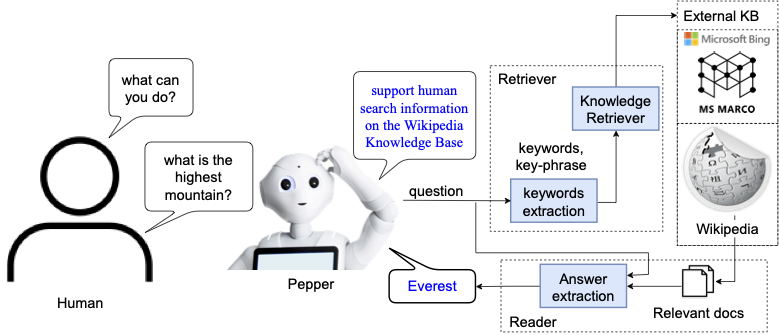
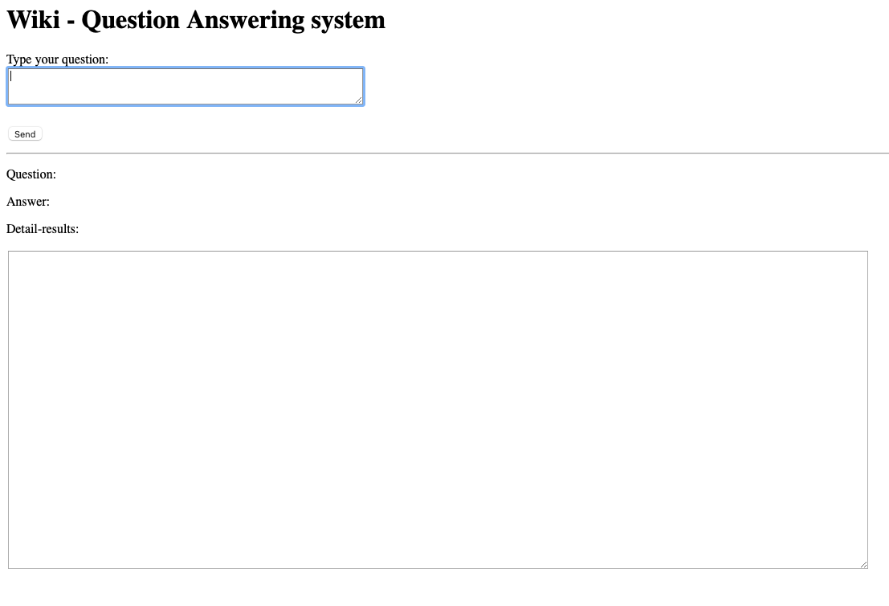

# Open QA system
## Overview 
This system contains 2 components: 
- Retriever: retrieve the relevant document from the input question.
- Reader: extract the answer from the pair of question and retrieved document. 



## Environments
```bash  

conda create -n openqa python=3.8
conda activate openqa
pip install -r requirements.txt
```

> **Note**: please check file `requirements.txt` to install `pyserini` library in right way. Or check the official [homepage](https://github.com/castorini/pyserini)  of this package.


## Run  

```bash
# these commands is ran from root folder of this project.

# if you want to train Reader locally
git submodule init 
git submodule update 

# run server
python src/server.py
```

> **Note**: when you run this command, it will download a large corpus (e.g. Wikipedia indexed corpus) size 40 - 50 GB.

Access to your localhost web-server [http://localhost:7009/](http://localhost:7009/) to enjoy the result.



##  License
MIT-licensed. 
